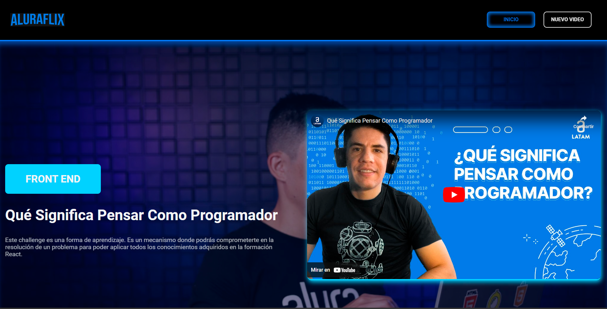
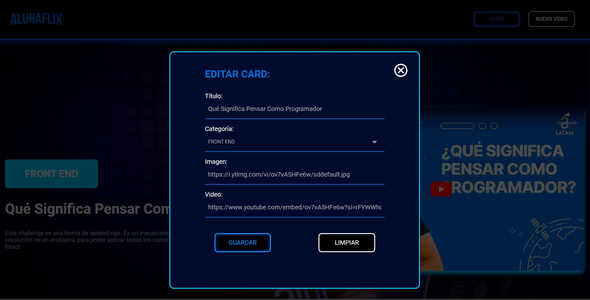
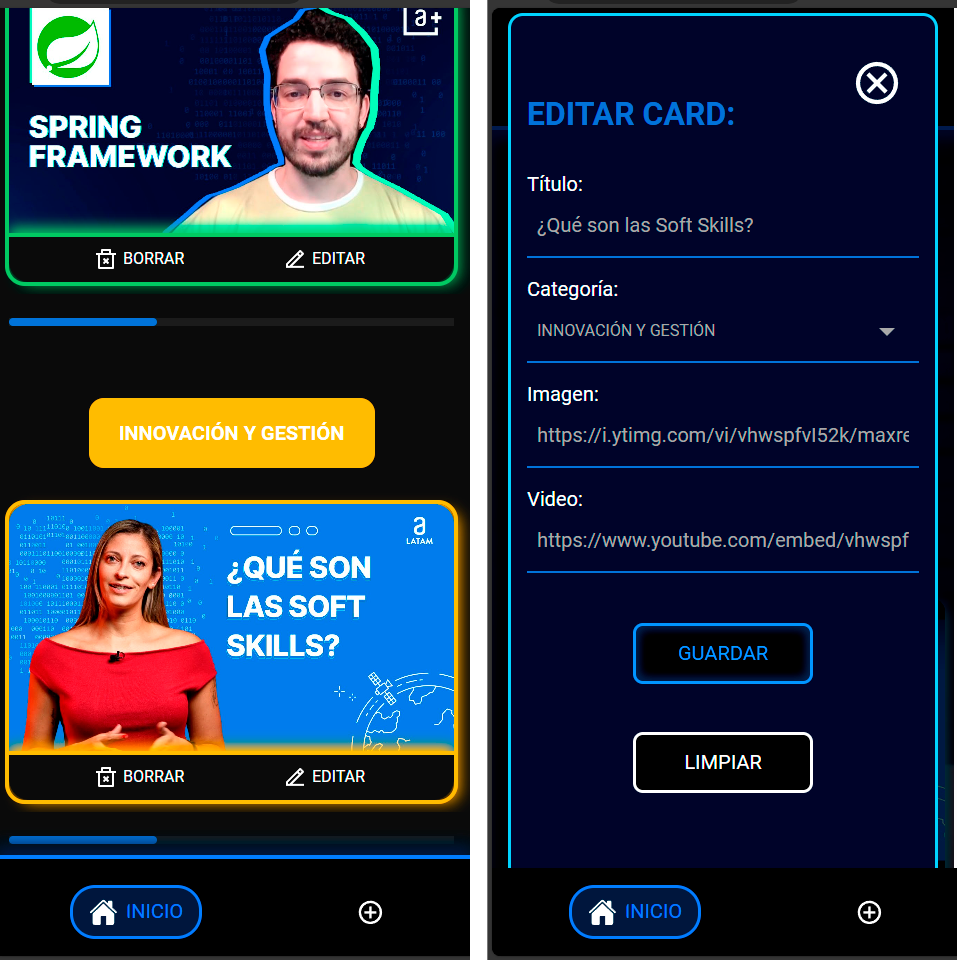

  

## Alura Flix

¡Bienvenido a **Alura Flix**! Este proyecto es una plataforma de videos desarrollada para el programa ONE, creada con React y Vite. Puedes ver el sitio deployado desde [aquí](https://alura-flix-jade-gamma.vercel.app/).

En caso que decidas descargar el proyecto para usarlo de manera local, simplemente debes colocar el siguiente comando en la terminal: 

  <input type="text" value="npm start" id="npmCommand" readonly style="width: 100px; padding: 5px; text-align: center; border: 1px solid #ccc; border-radius: 4px;">
  <button onclick="copyToClipboard()" style="padding: 5px 10px; margin-left: 5px; background-color: #007BFF; color: white; border: none; border-radius: 4px; cursor: pointer;">Copiar</button>

## Descripción

Alura Flix es una plataforma diseñada para gestionar vídeos, donde los usuarios pueden navegar y ver diferentes videos con funcionalidades como listar, registrar, actualizar y eliminar videos. La aplicación está diseñada con una interfaz moderna y características interactivas para mejorar la experiencia del usuario. Además, el diseño responsivo garantiza que la plataforma sea accesible desde cualquier dispositivo, ya sea una computadora de escritorio, una tableta o un teléfono móvil.

Alura Flix no solo proporciona una experiencia visual agradable, sino que también asegura un rendimiento óptimo gracias a la implementación de buenas prácticas en el desarrollo de software.

## Características 

Gestión de Videos desde API Fake (JSON Server):

- Listar Videos: Consultar y mostrar todos los videos disponibles en la API fake.
- Registrar Videos: Añadir nuevos videos.
- Actualizar Información de Videos: Modificar y actualizar los detalles de los videos almacenados en la API fake como titulo, nombre, imagen y url del video.
- Eliminar Videos: Eliminar videos específicos de la API fake.

## Tecnologías Utilizadas

- React: Una biblioteca de JavaScript para construir interfaces de usuario.
- Vite: Un entorno de desarrollo frontend rápido.
- CSS: Para el diseño y las animaciones.
- Vercel: Para el despliegue del proyecto.

## Diseño

El diseño de éste proyecto se basó en el figma proporcionado por Alura, puedes ver el figma [aquí](https://www.figma.com/design/fq7mKIvvVXYylv8eti3hjm/New-AluraFlix---ESP?node-id=18759-221&t=IH7WsrXTHgOkpEWh-0). Se agregaron algunas animaciones y cambios menores al diseño pero sin salir del modelo original.

  
  
  

